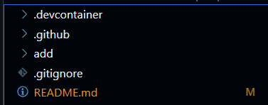

# Rust SQLite Demo Repository

Be sure to start with this template repository:

https://github.com/johncoogan53/Rust-Template

Once you have made a new repository and launched a codespace you will see these files:

I have made this template so that it comes with base CI/CD functionality 